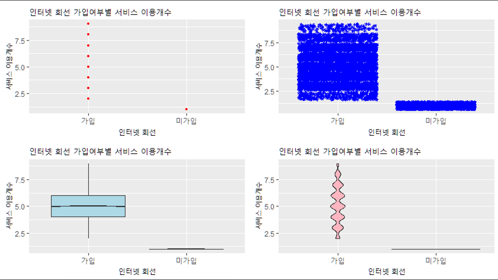

# 데이터 시각화

## 📃 Content

    IBM Watson Analytics®에서 제공하는 비 식별화된 7043명의 통신사 이용 고객 데이터를 대상으로
    어떤 요인이 통신사 이탈에 주요한 영향을 미치는지와 이탈 방지를 위한 대책 마련 모색을 해 본 R 스크립트 입니다.

## 📋 Modeling

## 🧑‍💻 Coding Book

## 📈 Visualization

---

| 시각화                        |                  내용                  |
| :---------------------------- | :------------------------------------: |
|  |        통신사 이탈 인원수 분포         |
|  |            고객 등급별 분포            |
|  | 통신사 고객 등급에 따른 이탈 여부 분포 |
|  |    사용기간에 따른 평균 사용료 분포    |
|  |       성별에 따른 지출등급 분포        |
|  | 인터넷 회선 가입여부별 서비스 이용분포 |

## 📝 Review

---

분석 주제부터 시각화까지 본인이 관심있는 내용으로 진행하다보니, 보다 열정적으로 임했습니다. 단순히 결과 데이터의 통계적인 특성을 가지고 결과를 해석하는 데 그치지 않고, 그 결과를 통신업계에 종사하는 사람의 입장에서 어떠한 마케팅 전략을 펼칠 수 있을 지까지 모색해 보았습니다.
